# Windows 10 Pro 설치 매뉴얼

## 1. 백업 (스냅샷)
- 설치 시 구매한 라이센스 유지 목적으로 백업 생성
### 1-1. 파티션 설정
- Partition Wizard 실행
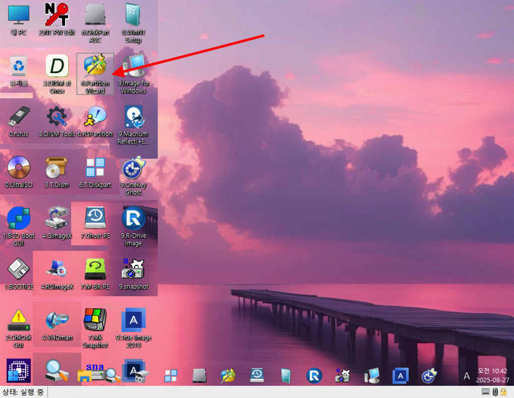
- C 파티션 선택
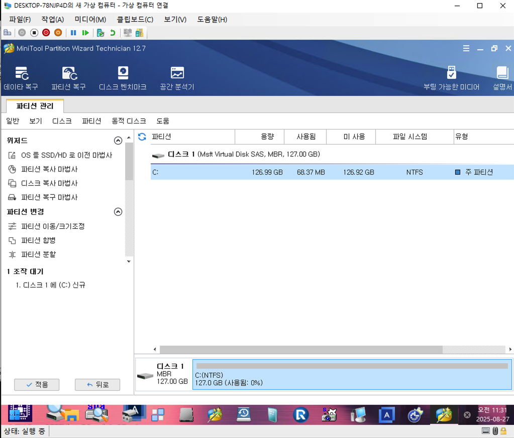
- 분할 선택
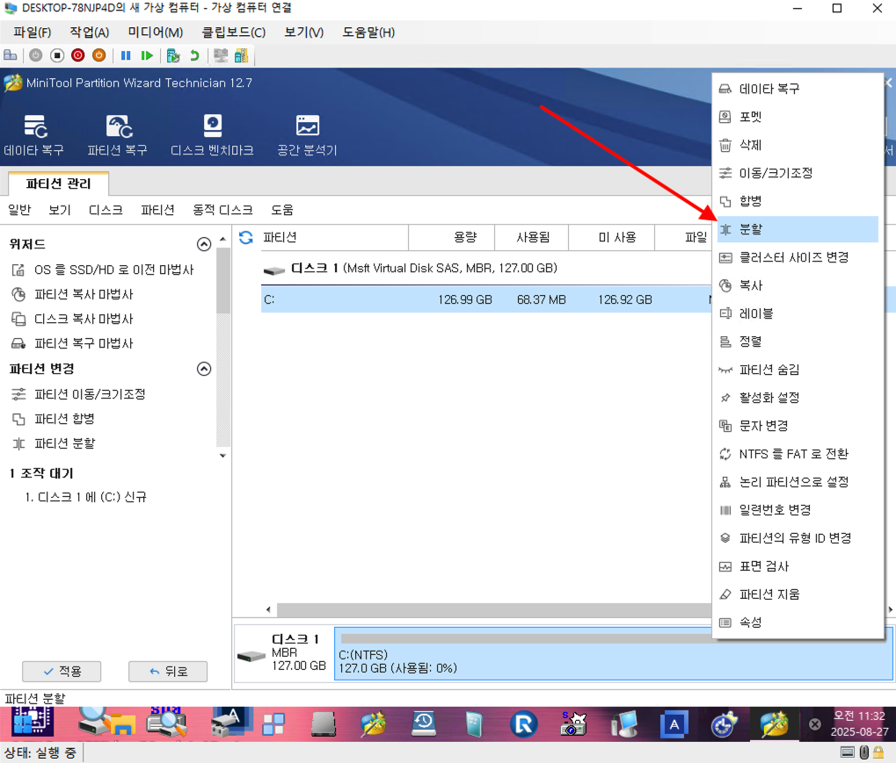
- 30기가 정도로 분할 설정 후 적용
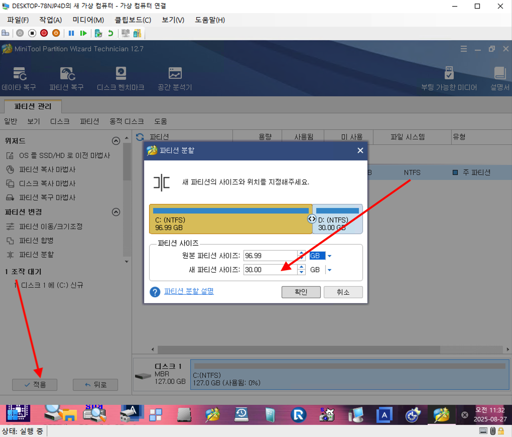
### 1-2. 스냅샷
- snapshot 실행
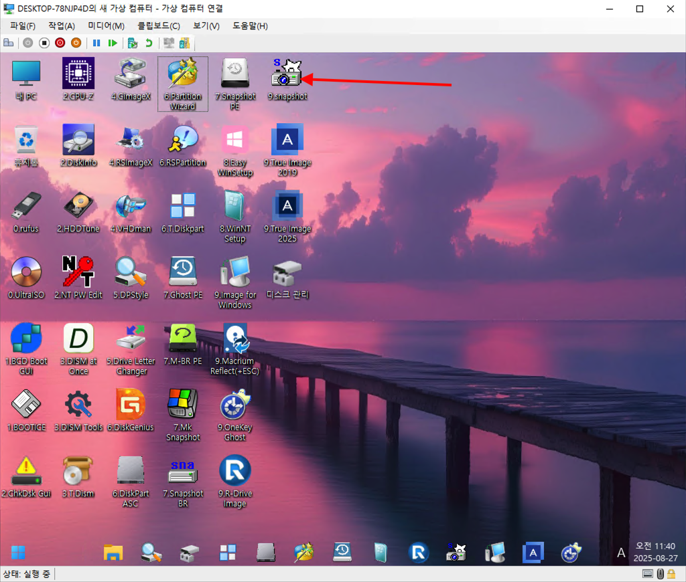
- 파티션 백업
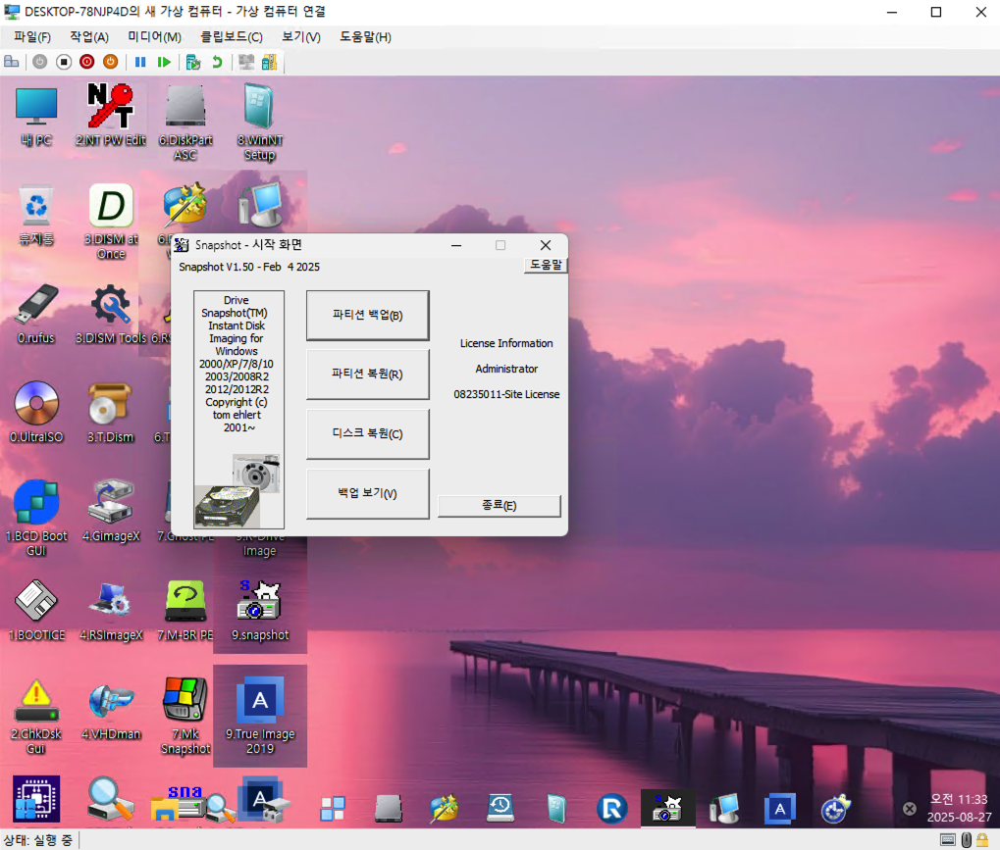
- 백업 대상 파티션 선택 (C파티션)
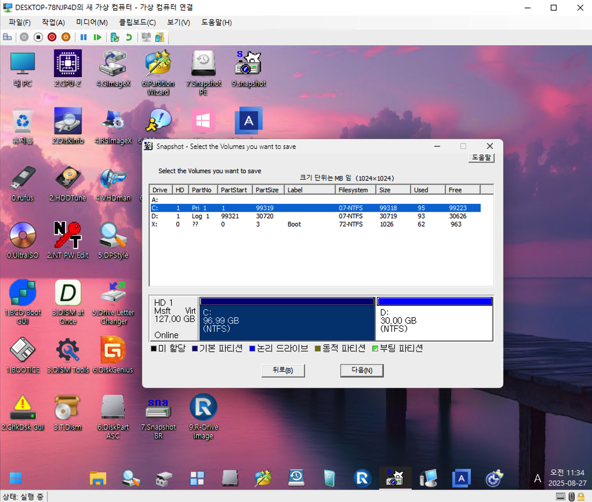
- 스냅샷 파일 저장
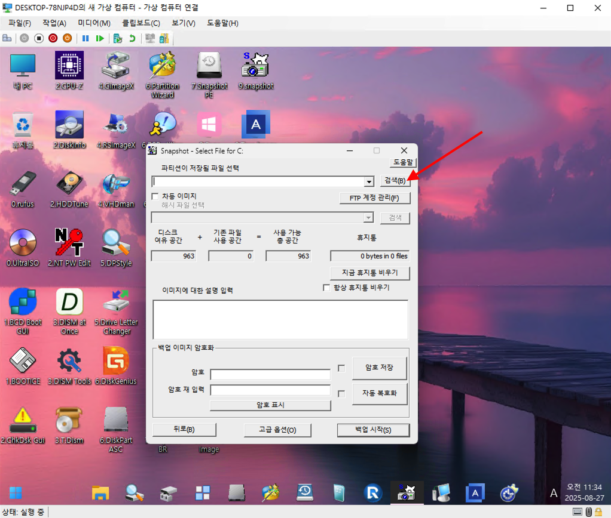
- 백업 시작
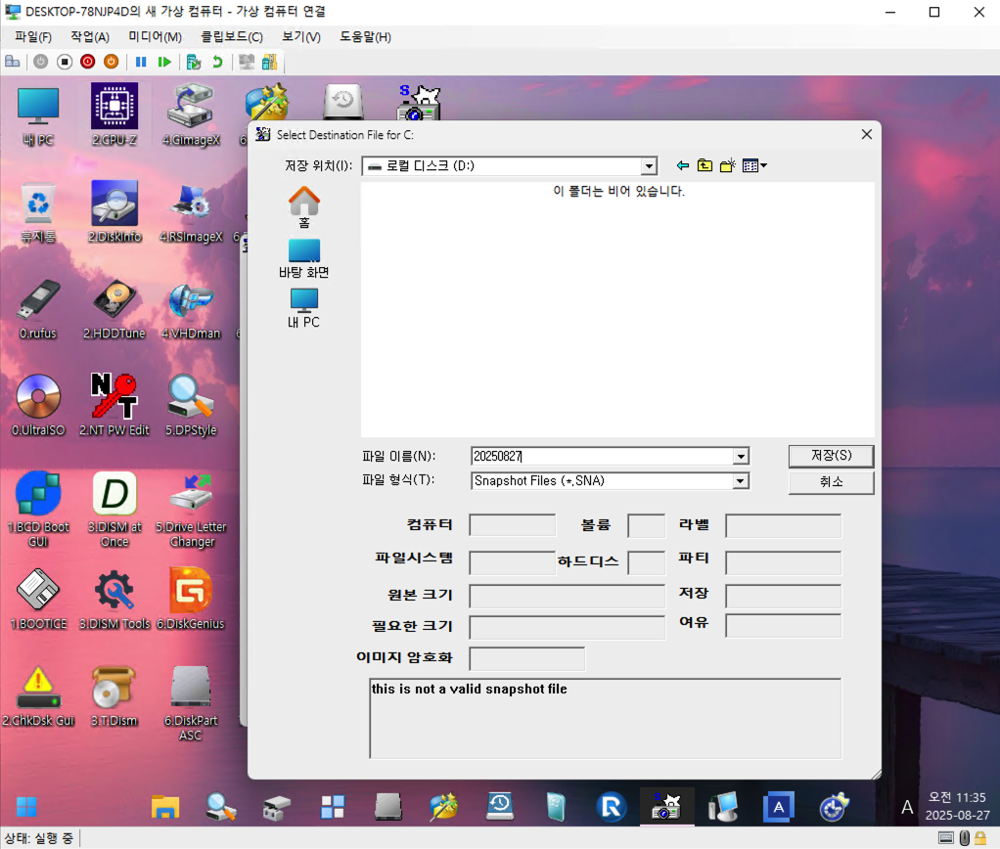
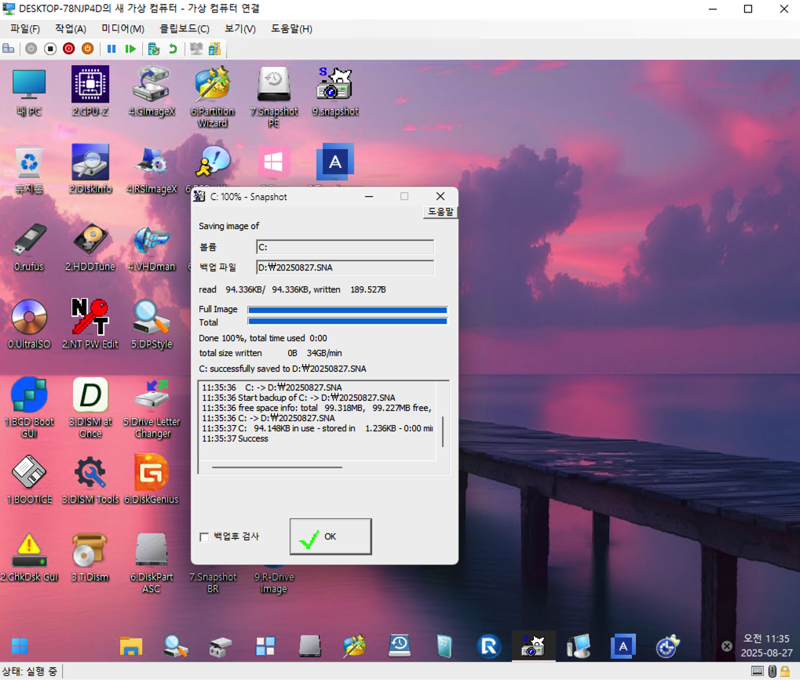
### 1-3. 파티션 숨김 
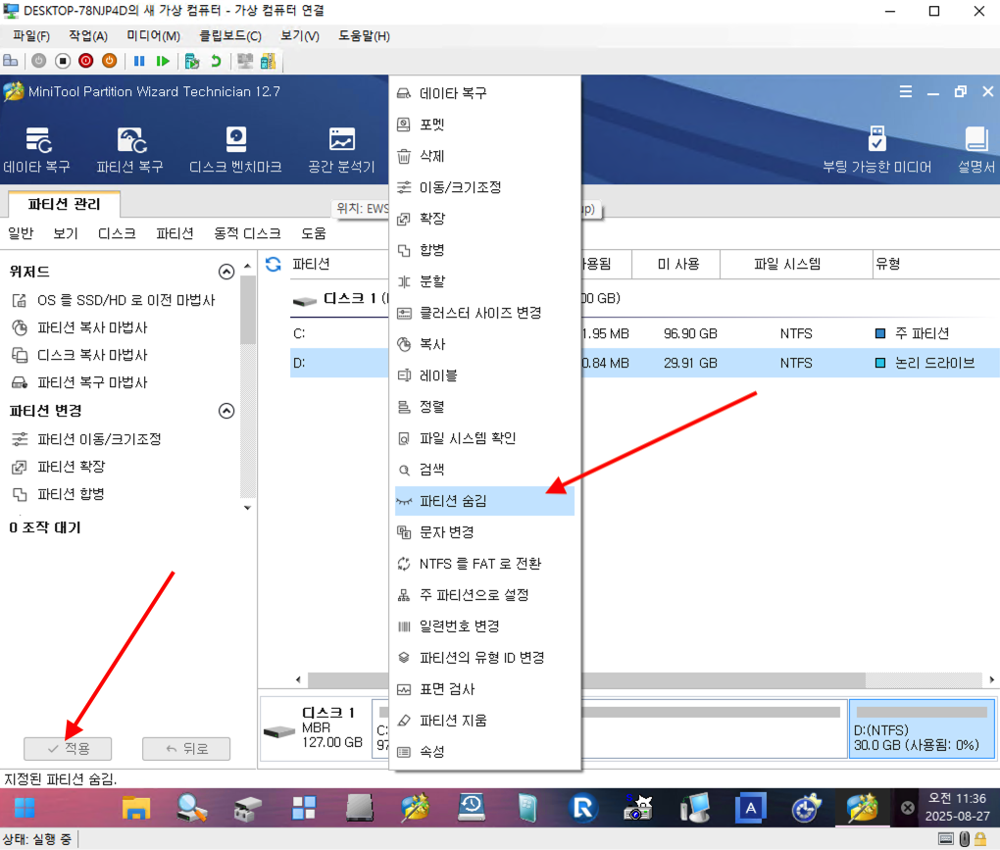

## 2. 재부팅 후 정상 작동 확인
- 크롬, 네이트온, 텔레그램 등 설치

!!! tip "추가 인증이 필요한 경우"

      - 설치 시 설치 항목 체크 필수!!
      - 네이트온의 경우 터보 클리너 설치 해제 필수!

## 3. 스냅샷 복구
- Win11PE USB 부팅 [(참고)](#1)
- [Partition Wizard 실행](#1-1)
- 숨겨진 파티션 선택 후 파티션 숨김 해제
- 새 드라이브 문자 할당
- [snapshot 실행](#1-2)
- 파티션 복원
- 숨김 해제된 파티션에서 스냅샷 파일 선택
- 복원될 파티션 선택 (C 파티션 선택) 하여 진행
- [파티션 숨김](#1-3)
- 재부팅 후 정상 확인